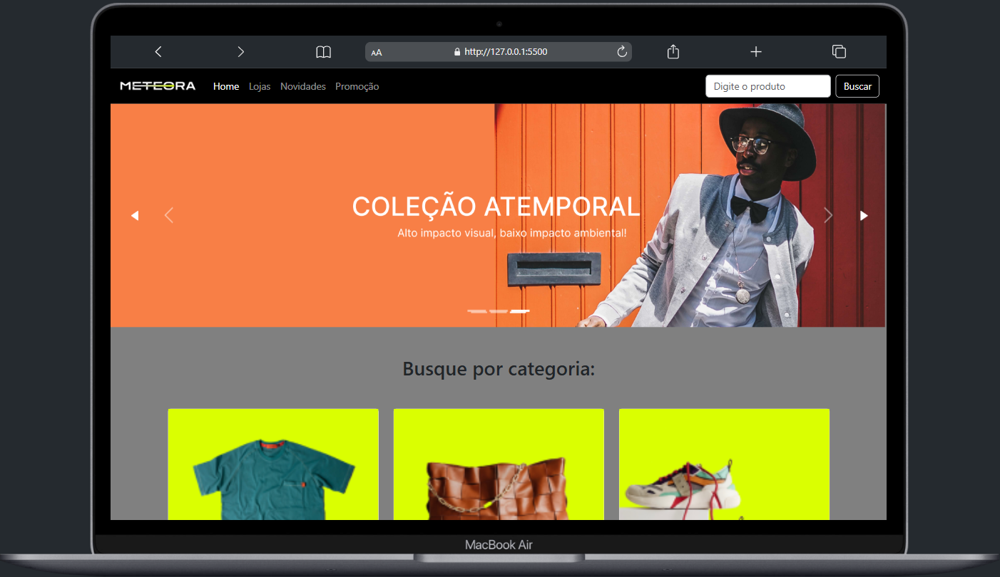

# 🛍️ Meteora | E-commerce Responsivo

Projeto desenvolvido durante o curso Front-end da [Alura](https://www.alura.com.br/), onde criamos uma **página de e-commerce moderna, responsiva e acessível** para a loja fictícia **Meteora**.

O projeto simula uma vitrine virtual com categorias, produtos e um formulário de cadastro com feedback ao usuário.

---

## 🌟 Funcionalidades

- ✅ Menu de navegação com layout responsivo
- ✅ Banner principal com **carrossel** adaptado a mobile, tablet e desktop
- ✅ Seção de **categorias visuais** de produtos
- ✅ Lista de **produtos populares** com descrição e botão
- ✅ Formulário de **cadastro de e-mail com botão de envio**
- ✅ Seção com **facilidades** da loja (ícones, texto e acessibilidade)
- ✅ Rodapé com créditos

---

## 📱 Responsividade

O layout se adapta perfeitamente aos tamanhos:
- Mobile (até 767px)
- Tablet (768px até 1199px)
- Desktop (a partir de 1200px)

---

## 🧪 Tecnologias Utilizadas

- `HTML5`
- `CSS3`
- `Bootstrap 5.3`
- `Ícones via Bootstrap Icons CDN`

---

## 💻 Como Rodar o Projeto

1. Clone o repositório:
```bash
git clone https://github.com/Waldemarleo/Site-Meteora.git
```

2. Acesse a pasta:
```bash
cd Site-Meteora
```

3. Abra o arquivo `index.html` no navegador  
ou use Live Server (VS Code) para simular um servidor local.

---



---

## 🧠 Aprendizados

Esse projeto me ajudou a praticar:

- Estruturação de páginas com HTML semântico
- Responsividade com Bootstrap e media queries
- Manipulação de layout com classes utilitárias
- Organização de imagens por breakpoint (mobile/tablet/desktop)
- Criação de interfaces acessíveis e responsivas
- Estilização de botões, cards e formulários

---

## 👨‍💻 Desenvolvido por

**Waldemar Leonardo**  
🔗 [GitHub](https://github.com/Waldemarleo)  
🔗 [LinkedIn](https://www.linkedin.com/in/waldemar-leonardo/)

---

## 📝 Licença

Projeto fictício e educativo, criado durante o curso Front-end da **Alura**.  
**Sem fins comerciais.**
